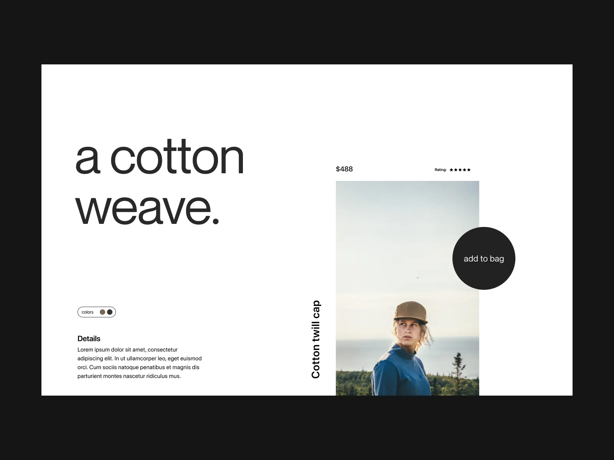

# Small Projects for Practice

This repository contains multiple small projects created for practice, fun, revision, and exploring various frontend concepts.

## Projects and Their Designs

### [Project 1](./Project-1/)

A simple project demonstrating basic HTML, CSS concepts.

### [Project 2](./Project-2/)

A slightly advanced project focusing on cool layout and interactivity.

### [Project 3](./Project-3/)

A creative project to revise and apply learned concepts.

